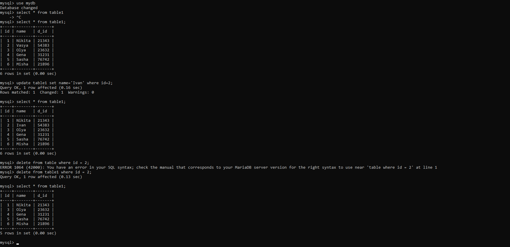

МИНИСТЕРСТВО НАУКИ И ВЫСШЕГО ОБРАЗОВАНИЯ
РОССИЙСКОЙ ФЕДЕРАЦИИ
ФЕДЕРАЛЬНОЕ ГОСУДАРСТВЕННОЕ БЮДЖЕТНОЕ
ОБРАЗОВАТЕЛЬНОЕ УЧРЕЖДЕНИЕ ВЫСШЕГО ОБРАЗОВАНИЯ
«САХАЛИНСКИЙ ГОСУДАРСТВЕННЫЙ УНИВЕРСИТЕТ»

 

Институт естественных наук и техносферной безопасности

Кафедра информатики

Пак Никита Витальевич

 

Лабораторная работа №10

01.03.02 Прикладная математика и информатика

 

Научный руководитель

Соболев Евгений Игоревич

Южно-Сахалинск

2022 г.

<b>ВВЕДЕНИЕ</b>

MySQL — свободная реляционная система управления базами данных[8]. Разработку и поддержку MySQL осуществляет корпорация Oracle, получившая права на торговую марку вместе с поглощённой Sun Microsystems, которая ранее приобрела шведскую компанию MySQL AB. Продукт распространяется как под GNU General Public License, так и под собственной коммерческой лицензией. Помимо этого, разработчики создают функциональность по заказу лицензионных пользователей. Именно благодаря такому заказу почти в самых ранних версиях появился механизм репликации.

MySQL является решением для малых и средних приложений. Входит в состав серверов WAMP, AppServ, LAMP и в портативные сборки серверов Денвер, XAMPP, VertrigoServ. Обычно MySQL используется в качестве сервера, к которому обращаются локальные или удалённые клиенты, однако в дистрибутив входит библиотека внутреннего сервера, позволяющая включать MySQL в автономные программы.

Гибкость СУБД MySQL обеспечивается поддержкой большого количества типов таблиц: пользователи могут выбрать как таблицы типа MyISAM, поддерживающие полнотекстовый поиск, так и таблицы InnoDB, поддерживающие транзакции на уровне отдельных записей. Более того, СУБД MySQL поставляется со специальным типом таблиц EXAMPLE, демонстрирующим принципы создания новых типов таблиц. Благодаря открытой архитектуре и GPL-лицензированию, в СУБД MySQL постоянно появляются новые типы таблиц.

РЕШЕНИЕ ЗАДАЧ

1.
  

ВЫВОД

Подводя итог всему сказанному, могу сделать вывод, что, поработав на MySQL, я узнал много нового и применил это на практике. Все задачи были выполнены.
