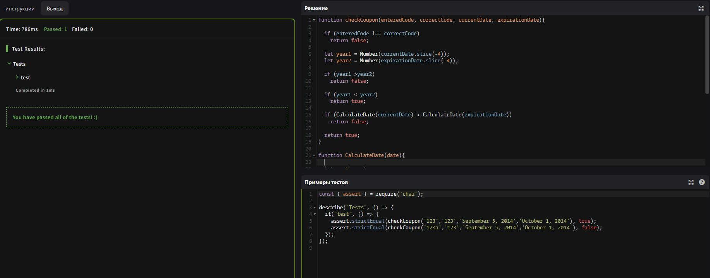
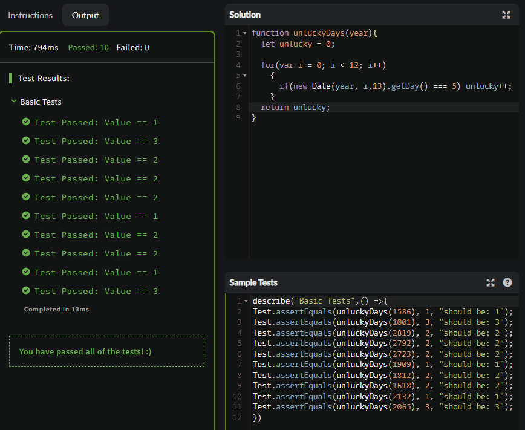
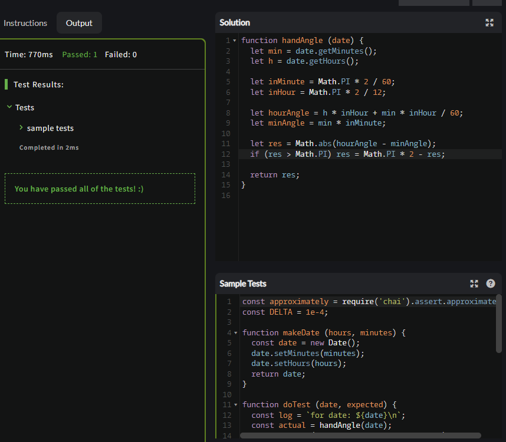
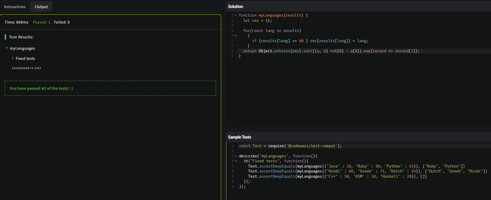
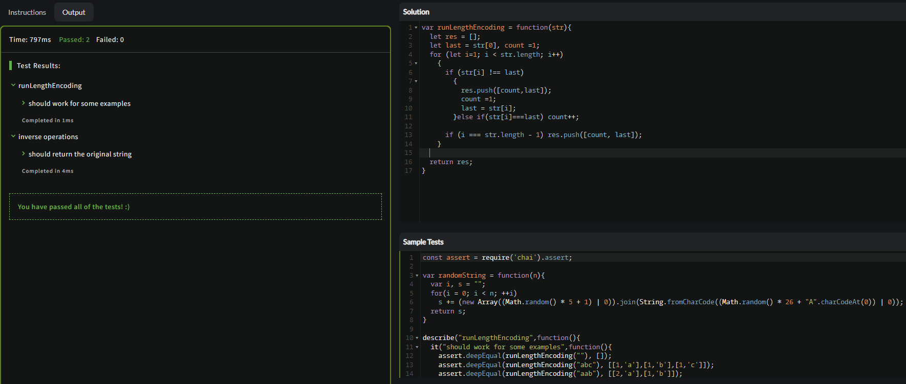
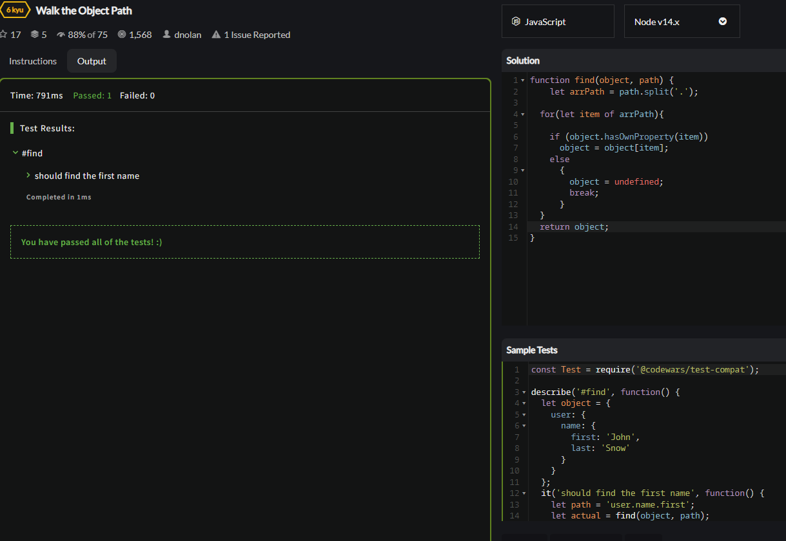

<p align = "center">МИНИСТЕРСТВО НАУКИ И ВЫСШЕГО ОБРАЗОВАНИЯ
РОССИЙСКОЙ ФЕДЕРАЦИИ
ФЕДЕРАЛЬНОЕ ГОСУДАРСТВЕННОЕ БЮДЖЕТНОЕ
ОБРАЗОВАТЕЛЬНОЕ УЧРЕЖДЕНИЕ ВЫСШЕГО ОБРАЗОВАНИЯ
«САХАЛИНСКИЙ ГОСУДАРСТВЕННЫЙ УНИВЕРСИТЕТ»</p>
<br>
<p align = "center">Институт естественных наук и техносферной безопасности</p>
<p align = "center">Кафедра информатики</p>
<p align = "center">Пак Никита Витальевич</p>
<br>
<p align = "center">Лабораторная работа №6</p>
<p align = "center">01.03.02 Прикладная математика и информатика</p>
<br>
<p align = "right" >Научный руководитель</p>
<p align = "right" >Соболев Евгений Игоревич</p>
<p align = "center" >Южно-Сахалинск</p>
<p align = "center" >2022 г.</p>
<p align = "center" ><b>ВВЕДЕНИЕ</b></p>
<p>DOM — это независящий от платформы и языка программный интерфейс, позволяющий программам и скриптам получить доступ к содержимому HTML-, XHTML- и XML-документов, а также изменять содержимое, структуру и оформление таких документов.</p>
<p>Модель DOM не накладывает ограничений на структуру документа. Любой документ известной структуры с помощью DOM может быть представлен в виде дерева узлов, каждый узел которого представляет собой элемент, атрибут, текстовый, графический или любой другой объект. Узлы связаны между собой отношениями «родительский-дочерний».</p>
<p>Изначально различные браузеры имели собственные модели документов (DOM), несовместимые с остальными. Для обеспечения взаимной и обратной совместимости специалисты международного консорциума W3C классифицировали эту модель по уровням, для каждого из которых была создана своя спецификация. Все эти спецификации объединены в общую группу, носящую название W3C DOM.</p>
<p>Ещё один интерфейс прикладного программирования, называемый JDOM, обеспечивает более высокий, чем W3C DOM, уровень для работы с XML-документами на Java.</p>
<p align = "center" >РЕШЕНИЕ ЗАДАЧ</p>
 
 ```js 
<script>
        function z1()
        {
            alert("HELLOOOOOOOOOOOOOOO!");
        }

        function z2()
        {
            let txt = 'new '; 
            document.getElementById("text").value += txt;
        }

        function z3()
        {
            let text = document.getElementById("text3").value;
            alert(text);
        }

        function z4()
        {
            let chislo = document.getElementById("text4").value;
            document.getElementById("text4").value = chislo*chislo;
        }
        function z5()
        {
            let text1 = document.getElementById("text5.1").value;
            let text2 = document.getElementById("text5.2").value;
            document.getElementById("text5.1").value = text2;
            document.getElementById("text5.2").value = text1;
        }
        function z6()
        {
            let text = document.getElementById("text6").value;
            if (text=='Привет')
            {
                document.getElementById("text6").value = "Пока";
            }
            else if(text=='Пока')
            {
                document.getElementById("text6").value = "Привет";
            }
        }

        function z7()
        {
            let text = document.getElementById("text7");
            text.style.color = "blue";
        }

        function z8_1()
        {
            temp = document.getElementById("text8");
            temp.disabled = true;
        }
        function z8_2()
        {
            temp = document.getElementById("text8");
            temp.disabled = false;
        }

        function z9()
        {
            alert("OOO MY GOD!");
        }

        function z12()
        {
            let image = document.getElementById("im");
            image.src = "US22.jpg";
        }
        function z13()
        {
            let prop = alert("How do you do?");
            return this.prop;
        }

        
        function z14()
        {
            let btn = document.getElementById("btn14");
            btn.onclick = ChangeInput(this.document.getElementById("text14"), "new");
            function ChangeInput(elem, text)
            {
                elem.value = text;
            }
        }

        function z15()
        {
            let btn  = document.getElementById("btn15");
            btn.disabled = true;
        }

        function z16()
        {
            let btn = document.getElementById("btn16");
            var count = document.getElementById("lab16").innerHTML;
            if(btn.click)
            {
                count++;
            } 
            document.getElementById("lab16").innerHTML = count;
        }
        function z17()
        {
            document.body.style.cursor = "se-resize";
        }

        function z18()
        {
            document.getElementById('hide').hidden = true;
        }

        function z19()
        {
            document.getElementById('btn19').hidden = true;
        }


        function summ(){
            if(Number(document.getElementById('first').value) && Number(document.getElementById('second').value))
            {
                document.getElementById('result').value = Number(document.getElementById('first').value) + Number(document.getElementById('second').value);
            }
            else
            {
                alert('Вам необходимо ввести 2 числа')
            }
        }

        function razn(){
            if(Number(document.getElementById('first').value) && Number(document.getElementById('second').value))
            {
                document.getElementById('result').value = Number(document.getElementById('first').value) - Number(document.getElementById('second').value);
            }
            else
            {
                alert('Вам необходимо ввести 2 числа')
            }
        }
        
        function proiz(){
            if(Number(document.getElementById('first').value) && Number(document.getElementById('second').value))
            {
                document.getElementById('result').value = Number(document.getElementById('first').value) * Number(document.getElementById('second').value);
            }
            else
            {
                alert('Вам необходимо ввести 2 числа')
            }
        }

        function del(){
            if(Number(document.getElementById('first').value) && Number(document.getElementById('second').value))
            {
                document.getElementById('result').value = Number(document.getElementById('first').value) / Number(document.getElementById('second').value);
            }
            else
            {
                alert('Вам необходимо ввести 2 числа')
            }
        }

        function first (){
            active = 1;
        }

        function second (){
            active = 2;
        }

        function input (a){
            let where = 0;
            switch(active)
            {
                case 1:
                    document.getElementById('first').value += a;
                    break;
                case 2:
                    document.getElementById('second').value += a;
                    break;
                default:
                    break;
            }
        }

        function empty(){
            document.getElementById('first').value = ""
            document.getElementById('second').value = ""
            document.getElementById('result').value = ""
        }

    </script>
    <p> 1zadanie </p> <button type="button" onclick=z1()>alert</button>
    <p> 2zadanie </p> <button type="submit" onclick=z2()>text change input</button>
    <input type="text" name = "text" id = "text" value="" />
    <p> 3zadanie </p> <button type="button" onclick=z3()>conclusion input</button>
    <input type="text" name = "text" id = "text3" value="" />
    <p> 4zadanie </p> <button type="submit" onclick=z4()>square number</button>
    <input type="text" name = "text" id = "text4" value="" />
    <p> 5zadanie </p> <button type="button" onclick=z5()>reverse</button>
    <input type="text" name = "text" id = "text5.1" value="" />
    <input type="text" name = "text" id = "text5.2" value="" />
    <p> 6zadanie </p> <button type="button" onclick=z6()>change text</button>
    <input type="text" name = "text" id = "text6" value="Привет" />
    <p> 7zadanie </p> <button type="button" onclick=z7()>color text</button>
    <input type="text" name = "text" id = "text7" value="Что-то написано" />
    <p> 8zadanie </p> <button type="button" onclick=z8_1()>1</button><button type="button" onclick=z8_2()>2</button></br>
    <input type="text" name = "text" id = "text8" value="1 блочит, 2 наоборот" />
    <p> 9zadanie </p> <button type="button" onmouseover=z9()>onmouseover</button>
    <p> 10zadanie </p> <button type="button" ondblclick=z9()>doubleclick</button>
    <p> 11zadanie </p> <div onmouseover=z9()> </div>
    <p> 12zadanie </p></br>
    
    <button type="button" onclick=z12()>change image</button>
    <p> 13zadanie</p></br>
    <button type="button" onclick=z13()>alert через this</button>
    <p> 14zadanie </p> <button type="button" name = "btn14" onclick=z14() id ="btn14">text change input</button>
    <input type="text" name = "text" id = "text14" value="Nya" />
    <p> 15zadanie </p> <button type="button" name = "btn15" onclick=z15() id ="btn15">disabled button</button>
    <p> 16zadanie </p> <button type="button" name = "btn16" onclick=z16() id ="btn16">count button</button><label id = "lab16">0</label>
    <p> 17zadanie </p> <button type="button" name = "btn17" onclick=z17() id ="btn17">cursor</button>
    <p> 18zadanie </p> <input type="button" onclick=z18() id="hider" value="Нажмите, чтобы спрятать текст" />
    <div id="hide">Текст</div>
    <p> 19zadanie </p> <button type="button" name = "btn19" onclick=z19() id ="btn19">invize button</button>
    <p> 20zadanie </p>
    <input disabled type="text" name="first" id="first"> <input disabled type="text" name="second" id="second"> <span> = </span> <input disabled type="text" name="result" id="result"><br><br>
    <button onclick="summ()">Сумма</button><button onclick="razn()">Разность</button><button onclick="proiz()">Произведение</button><button onclick="del()">Частное</button><br><br>
    <button onclick="input(1)">1</button><button onclick="input(2)">2</button><button onclick="input(3)">3</button><br><br>
    <button onclick="input(4)">4</button><button onclick="input(5)">5</button><button onclick="input(6)">6</button><br><br>
    <button onclick="input(7)">7</button><button onclick="input(8)">8</button><button onclick="input(9)">9</button><br><br>
    <button onclick="first()">first</button><button onclick="input(0)">0</button><button onclick="second()">second</button><br><br>
    <button onclick="empty()">Очистить</button><br><br>
```
<p align = "center" >CODEWARS</p>

1.

2.

3.

4.

5.

6.


***


<p align = "center" >ВЫВОД</p>
<p>Подводя итог всему сказанному, могу сделать вывод, что, поработав на javascript, я вспомнил многое и применил это на практике. Все задачи были выполнены.</p>