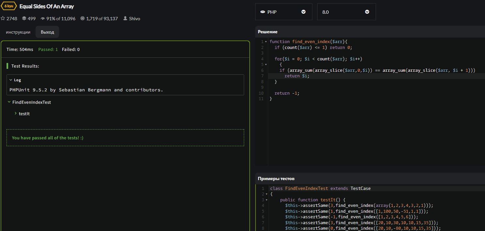

<p align = "center">МИНИСТЕРСТВО НАУКИ И ВЫСШЕГО ОБРАЗОВАНИЯ
РОССИЙСКОЙ ФЕДЕРАЦИИ
ФЕДЕРАЛЬНОЕ ГОСУДАРСТВЕННОЕ БЮДЖЕТНОЕ
ОБРАЗОВАТЕЛЬНОЕ УЧРЕЖДЕНИЕ ВЫСШЕГО ОБРАЗОВАНИЯ
«САХАЛИНСКИЙ ГОСУДАРСТВЕННЫЙ УНИВЕРСИТЕТ»</p>
<br>
<p align = "center">Институт естественных наук и техносферной безопасности</p>
<p align = "center">Кафедра информатики</p>
<p align = "center">Пак Никита Витальевич</p>
<br>
<p align = "center">Лабораторная работа №6</p>
<p align = "center">01.03.02 Прикладная математика и информатика</p>
<br>
<p align = "right" >Научный руководитель</p>
<p align = "right" >Соболев Евгений Игоревич</p>
<p align = "center" >Южно-Сахалинск</p>
<p align = "center" >2022 г.</p>
<p align = "center" ><b>ВВЕДЕНИЕ</b></p>
<p>DOM — это независящий от платформы и языка программный интерфейс, позволяющий программам и скриптам получить доступ к содержимому HTML-, XHTML- и XML-документов, а также изменять содержимое, структуру и оформление таких документов.</p>
<p>Модель DOM не накладывает ограничений на структуру документа. Любой документ известной структуры с помощью DOM может быть представлен в виде дерева узлов, каждый узел которого представляет собой элемент, атрибут, текстовый, графический или любой другой объект. Узлы связаны между собой отношениями «родительский-дочерний».</p>
<p>Изначально различные браузеры имели собственные модели документов (DOM), несовместимые с остальными. Для обеспечения взаимной и обратной совместимости специалисты международного консорциума W3C классифицировали эту модель по уровням, для каждого из которых была создана своя спецификация. Все эти спецификации объединены в общую группу, носящую название W3C DOM.</p>
<p>Ещё один интерфейс прикладного программирования, называемый JDOM, обеспечивает более высокий, чем W3C DOM, уровень для работы с XML-документами на Java.</p>
<p align = "center" >РЕШЕНИЕ ЗАДАЧ</p>
 
 ```js
<?php
    $var ="hello";
    echo "<h2>" . "1 zadanie" . "</h2>" . " ". $var . "</br>";
    echo $var[0] . ", " . $var[1] . ", " . $var[4] . "</br>" ;
    ?>
    <?php
    echo "<h2>" . "2 zadanie" . "</h2>" . "</br>";
    echo 60*60 . "</br>";
    ?>
    <?php
    echo "<h2>" . "3 zadanie" . "</h2>" ."</br>";
    $var = 1;
    $var +=12;
    $var -=14;
    $var *=5;
    $var /=7;
    ++$var;
    --$var;
    echo $var . "</br>"; 
    ?>
    <?php
    echo "<h2>" . "4 zadanie" . "</h2>" . "</br>";
    $a = 3;
    print "a=" . $a  . "</br>";
    ?>
    <?php
    echo "<h2>" . "5 zadanie" . "</h2>" . "</br>";
    $a = 10;
    $b = 2;
    echo "a= " . $a . "</br>";
    echo "b= " . $b . "</br>";
    echo "a+b= " . $otvet = $a + $b . "</br>" ; 
    echo "a-b= " . $otvet = $a - $b . "</br>";
    echo "a*b= " . $otvet = $a * $b . "</br>";
    echo "a/b= " . $otvet = $a / $b . "</br>";   
    ?>
     <?php
    echo "<h2>" . "6 zadanie" . "</h2>" . "</br>";
    $c = 15;
    $d = 2;
    $result = $c + $d;
    print "result = ". $result;
    ?>
    <?php
    echo "<h2>" . "7 zadanie" . "</h2>" . "</br>";
    $a = 10;
    $b = 2;
    $c = 5;
    $result = $a + $b + $c;
    print "result = ". $result;
    ?>
    <?php
    echo "<h2>" . "8 zadanie" . "</h2>" . "</br>";
    $a = 17;
    $b = 10;
    $c = $a - $b;
    $d = 7;
    $result = $c + $d;
    print "result = ". $result;
    ?>
    <?php
    echo "<h2>" . "9 zadanie" . "</h2>" . "</br>";
    $text = 'Привет мир!';
    print $text;
    ?>
    <?php
    echo "<h2>" . "10 zadanie" . "</h2>" . "</br>";
    $text1 = "Привет,";
    $text2 ="Мир!";
    $text ="";
    $text = $text1 . " ". $text2;
    print $text;
    ?>
    <?php
    echo "<h2>" . "11 zadanie" . "</h2>" . "</br>";
    $name = "Никита";
    print "Привет, " . $name . "!";
    ?>
    <?php
    echo "<h2>" . "12 zadanie" . "</h2>" . "</br>";
    $age = 19;
    print "Мне " . $age . " лет";
    ?>
    <?php
    $var ="abcde";
    echo "<h2>" . "13 zadanie" . "</h2>" . " ". $var . "</br>";
    echo $var[0] . ", " . $var[2] . ", " . $var[4] . "</br>" ;
    ?>
    <?php
    $var ="abcde";
    echo "<h2>" . "14 zadanie" . "</h2>" . " ". $var . "</br>";
    $var[0] = "!";
    echo $var . "</br>" ;
    ?>
    <?php
    $num ="12345";
    echo "<h2>" . "15 zadanie" . "</h2>" . " ". $num . "</br>";
    $var = $num[0] + $num[1] + $num[2] + $num[3] + $num[4];
    echo  "summa= " . $var . "</br>" ;
    ?>
    <?php
    echo "<h2>" . "16 zadanie" . "</h2>" . "</br>";
    echo "В часе: " . 60*60 . " секунд" . "</br>";
    echo "В сутках: " . 60*60*24 . " секунд" . "</br>";
    echo "В месяце: " . 60*60*24*30 . " секунд" . "</br>";
    ?>
    <?php
    echo "<h2>" . "17 zadanie" . "</h2>" . "</br>";
    $hour = "17";
    $minutes = "55";
    $seconds = "01";
    echo $hour . ":" . $minutes . ":" . $seconds . "</br>";
    ?>
    <?php
    $num = 7;
    echo "<h2>" . "18 zadanie" . "</h2>" . " ". $num . "</br>";
    $num *=$num;
    echo  "квадрат числа равен " . $num . "</br>";
    ?>
    <?php
    echo "<h2>" . "19 zadanie" . "</h2>" . "</br>";
    $var = 47;
    $var +=7;
    $var -=18;
    $var *=10;
    $var /=20;
    echo $var . "</br>"; 
    ?>
    <?php
    echo "<h2>" . "20 zadanie" . "</h2>" . "</br>";
    $text = 'Я';
    $text .=' хочу';
    $text .=' знать';
    $text .=' PHP!';
    echo $text;
    ?>
    <?php
    echo "<h2>" . "21 zadanie" . "</h2>" . "</br>";
    $var = 10;
    ++$var;
    ++$var;
    --$var;
    echo $var;
    ?>
    <?php
    echo "<h2>" . "22 zadanie" . "</h2>" . "</br>";
    $var = 10;
    $var +=7;
    ++$var;
    --$var;
    $var +=12;
    $var *=7;
    $var -=15;
    echo $var;
    ?>       
```
<p align = "center" >CODEWARS</p>

1.

2.

3.

4.

5.

6.

7.

8.

9.

10.

11.

12.

13.

***


<p align = "center" >ВЫВОД</p>
<p>Подводя итог всему сказанному, могу сделать вывод, что, поработав на php, я вспомнил многое и применил это на практике. Все задачи были выполнены.</p>